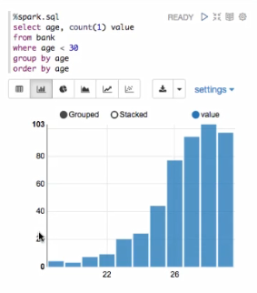

# Apache Hadoop and Spark Fundamentals (custom doc)

## Lesson 9.1 Apache Zepplin
JDK: 1.7 or above  
Reference: 
* Installing Zepplin: https://zeppelin.apache.org/docs/0.8.0/quickstart/install.html
* Overview: http://zeppelin.apache.org/docs/0.6.0/
* Hortonworks Docs: https://hortonworks.com/apache/zeppelin/

## What is Apache Zepplin?

Zepplin is a web-based notebook that enables interactive data analytics.
It provides data visualization which can be used with any language/
data-processing-backend through its interpreter.


### Sample Spark application in Zepplin

##### Load Data into Table
```java
%spark.spark
import org.apache.commons.io.IOUtils
import java.net.URL
import java.nio.charset.Charset

// Zepplin creates and injects sc (SparkContext) and sqlContext (HiveContext or sqlContext)
// So you don't need to create them manually

// Load bank data
val bankText = sc.parallize(
    IOUtils.toString(
        new URL("https://s3.amazonaws.com/apache-zeppelin/tutorial/bank/bank.csv"),
        Charset.forName("utf8")).split("\n"))
        
case class Bank(age: Integer, job: String, marital: String, education: String, balance: Integer)

val bank = bankText.map(s => s.split(";")).filter(s => s(0) != "\"age\"").map(
                s => Bank(s(0).toInt,
                    s(1).replaceAll("/"", ""),
                    s(2).replaceAll("/"", ""),
                    s(3).replaceAll("/"", ""),
                    s(5).replaceAll("/"", "").toInt
                )
            ).toDF()
bank.registerTempTable("bank")
```
Output: 

    import org.apache.commons.io.IOUtils
    import java.net.URL
    import java.nio.charset.Charset
    bankText: org.apache.spark.rdd.RDD[String] = Parallel CollectionRDD[437] at parallelize at <console>:77
    defined class Bank
    bank: org.apache.spark.sql.DataFrame = [age: int, job: string, marital: string, education: string, balance: int]
    
    
##### Example Chart
